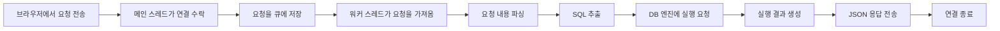

# group3-mini-dbms-API-server

```mermaid
flowchart LR
    A["브라우저에서 요청 전송"] --> B["메인 스레드가 연결 수락"]
    B --> C["요청을 큐에 저장"]
    C --> D["워커 스레드가 요청을 가져옴"]
    D --> E["요청 내용 파싱"]
    E --> F["SQL 추출"]
    F --> G["DB 엔진에 실행 요청"]
    G --> H["실행 결과 생성"]
    H --> I["JSON 응답 전송"]
    I --> J["연결 종료"]

```
