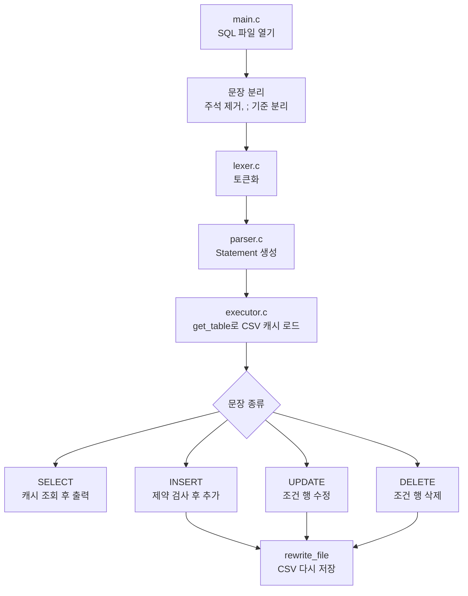

# SQL Processor Simple Flow

```mermaid
flowchart TD
    A["main.c<br/>SQL 파일 열기"] --> B["문장 분리<br/>주석 제거, ; 기준 분리"]
    B --> C["lexer.c<br/>토큰화"]
    C --> D["parser.c<br/>Statement 생성"]
    D --> E["executor.c<br/>get_table로 CSV 캐시 로드"]
    E --> F{"문장 종류"}
    F --> G["SELECT<br/>캐시 조회 후 출력"]
    F --> H["INSERT<br/>제약 검사 후 추가"]
    F --> I["UPDATE<br/>조건 행 수정"]
    F --> J["DELETE<br/>조건 행 삭제"]
    H --> K["rewrite_file<br/>CSV 다시 저장"]
    I --> K
    J --> K
```

한 줄 요약:

- `SQL 파일 읽기 -> 토큰화 -> 파싱 -> 캐시 로드 -> 실행 -> 필요 시 CSV 저장`
