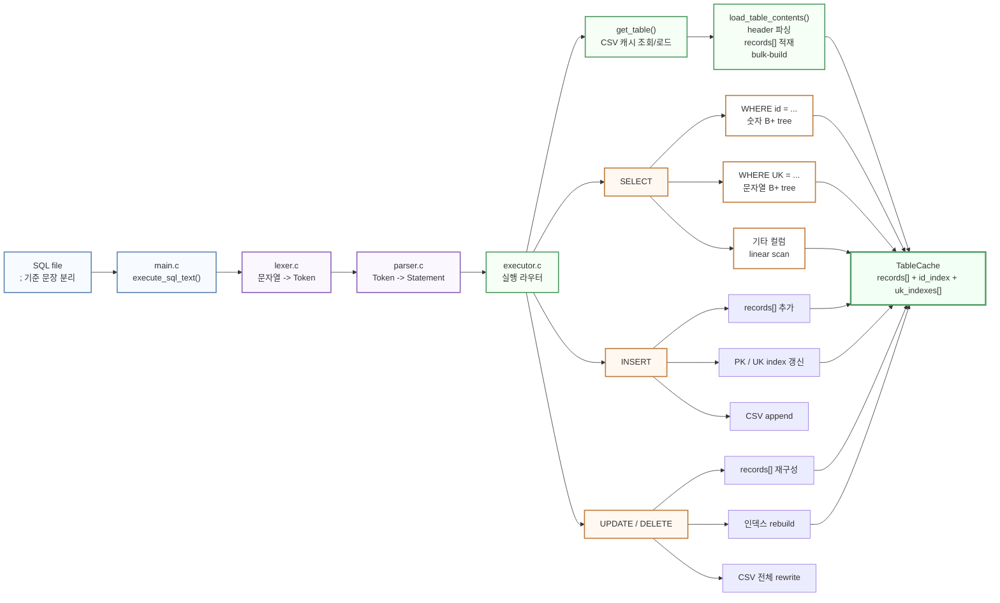
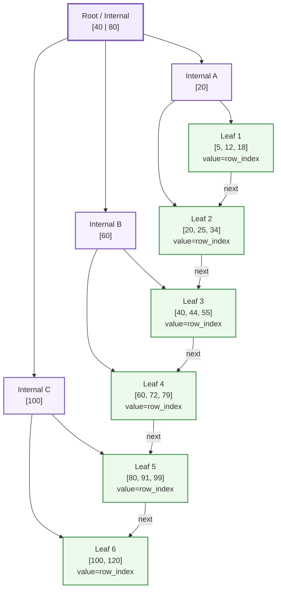

# FigJam 다이어그램 초안

이 파일은 FigJam에 옮겨 그릴 두 개의 다이어그램 원본이다.

- 1번: 전체 프로그램 다이어그램
- 2번: 현재 B+ tree 구조를 단순화한 그림

목표는 "코드 나열"이 아니라 "현재 어떤 방식을 썼는지"가 바로 보이도록 만드는 것이다.

## 1. 전체 프로그램 다이어그램

### 발표용 제목

`SQL를 Statement로 해석하고, 메모리 캐시 + B+ tree 인덱스로 실행 경로를 바꾸는 구조`

### 한 줄 메시지

- 저장은 CSV로 단순화했다.
- 실행은 Statement 중심으로 단순화했다.
- 조회는 PK/UK 인덱스로 빠르게 바꿨다.
- 인덱스가 없는 컬럼은 의도적으로 선형 탐색을 남겨 비교가 가능하게 했다.

### Mermaid 초안



### FigJam으로 옮길 때 강조할 박스

- 파랑 계열: 입력과 오케스트레이션
- 보라 계열: 해석 계층
- 초록 계열: 실행/캐시 계층
- 주황 계열: 저장/인덱스 방식

### 붙일 설명 메모

- `load`: row를 하나씩 insert하지 않고 bulk-build
- `select`: PK/UK는 index path, 나머지는 scan path
- `insert`: 메모리, 인덱스, 파일 append를 함께 유지
- `update/delete`: 안전하게 rebuild + rewrite

## 2. 현재 B+ tree 구조를 단순화한 그림

### 발표용 제목

`현재 B+ tree는 key에서 row_index를 찾기 위한 계층형 안내판`

### 한 줄 메시지

- internal node는 경계값만 가진다.
- leaf node는 실제 key와 row_index를 가진다.
- leaf끼리는 next 포인터로 이어진다.
- 검색은 위에서 아래로, 데이터 접근은 leaf에서 끝난다.

### Mermaid 초안



### FigJam으로 옮길 때 같이 써둘 메모

- 보라색 = internal node
  - 역할: 범위를 보고 child 방향을 선택
- 초록색 = leaf node
  - 역할: 실제 key와 row_index 저장
- `next`
  - 역할: leaf 레벨을 오른쪽으로 이어준다

### 검색 설명 의사코드

```text
search(key):
    node = root

    while node is internal:
        key가 어느 범위에 속하는지 비교
        해당 child로 내려감

    leaf에서 key를 찾음
    row_index 반환
```

### 삽입 설명 의사코드

```text
insert(key, row_index):
    leaf까지 내려감
    정렬 위치에 삽입

    if overflow:
        split
        오른쪽 leaf의 첫 key를 부모에 올림

    if 부모도 overflow:
        위로 split 전파

    if root까지 overflow:
        새 root 생성
```

## 3. 다이어그램을 회의에 쓰는 방법

- 첫 장은 `전체 흐름과 역할 분리`를 보는 용도다.
- 둘째 장은 `왜 B+ tree가 빠른지`를 설명하는 용도다.
- 세부 구현은 코드가 아니라 별도 의사코드 문서에서 확인한다.
- 회의 중 바뀌는 결정은 먼저 다이어그램 상자와 화살표부터 수정한다.
